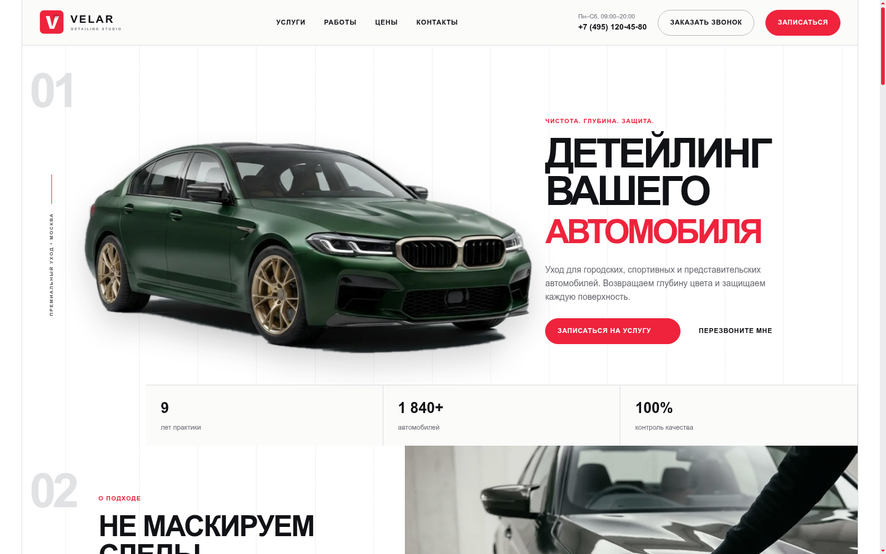
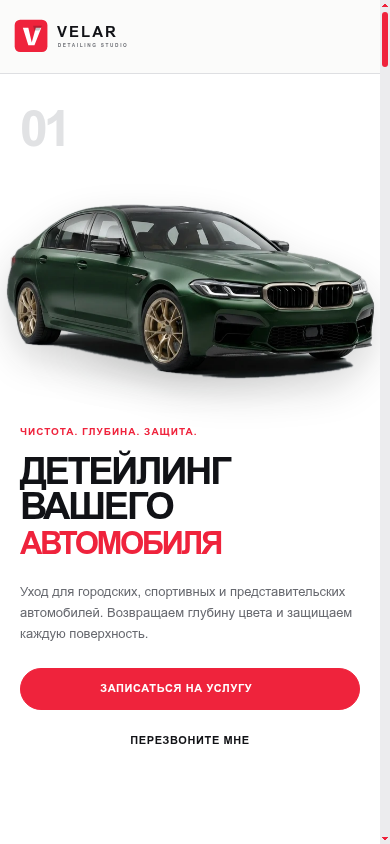
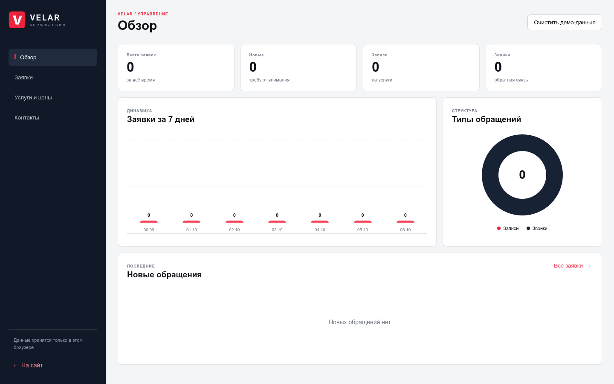

<p align="center">
  
</p>

<h1 align="center">VELAR Detailing Studio</h1>

<p align="center">Статический сайт премиальной детейлинг-студии с адаптивным интерфейсом и локальной панелью управления.</p>

<p align="center">
  
  
  
  
</p>



## О проекте

Проект повторяет редакционную композицию автомобильных каталогов: светлая сетка, крупная нумерация, выразительная типографика и красные акценты. Главный автомобиль подготовлен в PNG с прозрачным фоном, поэтому он естественно лежит поверх модульной сетки.

Сайт подходит для публикации на GitHub Pages и не требует сервера, базы данных или Docker.

## Возможности

- адаптивная главная страница;
- плавная навигация по разделам;
- индикатор прокрутки;
- ненавязчивые reveal- и hover-анимации;
- поддержка `prefers-reduced-motion`;
- услуги, цены, преимущества, портфолио и отзывы;
- галерея с клавиатурным управлением;
- формы записи и обратного звонка;
- локальный дашборд;
- поиск, фильтры, статусы и CSV-экспорт;
- изменение услуг, цен и контактов;
- автоматическая публикация через GitHub Actions.

## Мобильная версия

<p align="center">
  
</p>

Интерфейс рассчитан на ширину от 320 пикселей: меню превращается в компактную панель, сетки становятся одноколоночными, а формы учитывают высоту мобильного viewport и безопасные отступы.

## Панель управления



Панель доступна по адресу `/admin.html`. В ней можно:

- просматривать статистику обращений;
- следить за динамикой за семь дней;
- искать и фильтровать заявки;
- изменять статусы;
- удалять записи с подтверждением;
- выгружать CSV;
- менять названия услуг и цены;
- обновлять телефон, адрес и часы работы.

## Быстрый запуск

```bash
npm install
npm run dev
```

После запуска откройте:

- сайт: `http://localhost:8080`;
- панель: `http://localhost:8080/admin.html`.

Можно запустить без npm:

```bash
python3 -m http.server 8080
```

## Проверка кода

```bash
npm run check
npm run format:check
```

`check` проверяет синтаксис клиентских сценариев, а `format:check` — единый стиль исходников.

## Структура

```text
.
├── .github/workflows/pages.yml
├── docs/screenshots
├── images
├── scripts
│   ├── admin.js
│   └── site.js
├── styles
│   ├── admin.css
│   └── site.css
├── admin.html
├── index.html
├── privacy.html
└── consent.html
```

## Хранение данных

Проект остаётся полностью статическим. Формы, настройки и заявки сохраняются в `localStorage` текущего браузера. Это удобно для демонстрации на GitHub Pages, но данные не синхронизируются между устройствами.

Не используйте локальную панель для настоящих персональных данных. Для общей защищённой панели потребуется серверная авторизация и внешнее хранилище.

## Лицензия

Исходники можно использовать как основу собственного проекта. Фотографии и фирменные материалы перед коммерческим использованием следует проверить на соответствие условиям вашей публикации.
